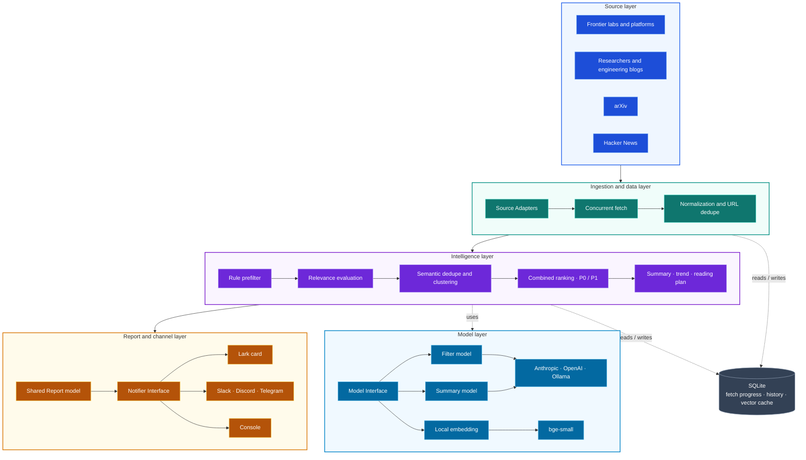

# Frontier Signal

**Frontier AI engineering papers, ideas, and systems — filtered and ranked daily.**

It scans research labs, engineering blogs, arXiv, and Hacker News, then filters,
deduplicates, summarizes, and delivers the results to Lark, Slack, Discord,
Telegram, or your terminal.

[简体中文](./README.zh-CN.md) · [System design](./docs/design.md) ·
[Contributing](./CONTRIBUTING.md)

---

## What it tracks

Frontier Signal covers **AI engineering**, not funding rounds or general
technology news.

| Group | Default sources |
|---|---|
| Frontier labs and platforms | Anthropic, OpenAI, Google DeepMind, Google AI, Google Research, Meta AI, Microsoft Research, Hugging Face, BAIR, PyTorch, Answer.AI |
| Researchers and engineering blogs | Lilian Weng, Sebastian Raschka, Chip Huyen, Jay Alammar, Eugene Yan, Simon Willison, Phil Schmid, Interconnects, Latent Space, The Gradient |
| Research and community | arXiv, Hacker News |

Instead of returning a chronological feed, it filters, deduplicates, summarizes,
and organizes the material into a report ready to read:

| Input | Output |
|---|---|
| Every new post | Only items that clear the relevance gate |
| Repeated coverage | URL and semantic deduplication |
| Headlines and excerpts | A concise summary and why it matters |
| A chronological stream | P0 must-reads, P1 follow-ups, and a weekly synthesis |

---

## What arrives

Each run reduces roughly 130 candidates to 5–8 items. Every item includes the
core finding and why it matters, organized into P0 must-reads and P1 follow-ups,
followed by the day's trend and a 30-minute reading plan:


---

## Quick start

Requirements: [uv](https://docs.astral.sh/uv/) and Python 3.11+.

### 1. Install and preview

```bash
git clone https://github.com/ll-leung/ai-research-radar.git frontier-signal
cd frontier-signal
uv sync
uv run radar preview
```

`preview` fetches the latest content and prints the result to the terminal without
sending a message. The first run needs neither an API key nor a webhook; if no
model is configured, keyword scoring is used. Every preview starts fresh and does
not affect later reports.

### 2. Configure models and delivery

```bash
uv run radar init
```

The setup wizard has four steps:

1. Choose a provider and set the filtering and summary models
2. Choose a delivery channel and enter its connection details
3. Choose English or Chinese reports
4. Set the daily delivery time

The result is saved to `.env`. The wizard detects the local timezone and updates
the GitHub Actions schedule. API keys and webhooks are hidden while you enter
them, and the wizard confirms when each value has been saved.

### 3. Test the configuration

```bash
uv run radar test-notify  # send a connection test to the configured channel
uv run radar test-layout  # send a layout sample to the configured channel
```

`test-layout` uses built-in sample content, so it fetches no sources and calls no
model. You can also target a channel or language explicitly:

```bash
uv run radar test-layout --channel lark
uv run radar test-layout --channel all
uv run radar test-layout --language en
```

`all` skips channels without credentials and reports each skip in the terminal.

### 4. Run the daily report

```bash
uv run radar preview  # inspect filtering and summaries without delivery
uv run radar run      # generate and deliver the daily report
```

`run` remembers processed items to prevent duplicate delivery. If nothing new is
selected, it sends no empty report and explains why in the terminal.

---

## How it works



The main path follows the content itself: frontier labs, researcher blogs, arXiv,
and Hacker News enter shared Source Adapters for concurrent fetching,
normalization, and URL deduplication before reaching the intelligence layer.

The intelligence layer applies rule filtering, LLM relevance evaluation,
semantic deduplication, topic clustering, and combined ranking before producing
P0/P1 items, summaries, the day's trend, and a reading plan.

The model layer exposes filtering, summarization, and embeddings through one
interface. The pipeline does not depend on a provider, so selecting Anthropic,
OpenAI, Ollama, or another compatible service requires no downstream changes.

The report and channel layer first produces a shared Report, then renders it
through Notifier adapters as a Lark card, webhook message, or console output.
SQLite independently stores fetch progress, history, and cached vectors. The CLI
and GitHub Actions are simply two entry points into this same processing path.

---

## Providers and delivery

`radar init` asks you to choose the provider, relevance-filter model, and summary
model during the first setup. Switching models later is a configuration change.

| Layer | Supported options |
|---|---|
| LLM | Anthropic; OpenAI; Ollama; other OpenAI-compatible endpoints; or none |
| Delivery | Lark / Feishu; Slack; Discord; Telegram; console |
| Language | Chinese (`zh`) or English (`en`) |

See [`.env.example`](./.env.example) for the available settings. Lark renders a
collapsible card; the other delivery channels use Markdown.

---

## Daily automation

The repository includes GitHub Actions workflows for daily and weekly reports.
Once configured, neither your computer nor a separate server needs to stay
running: GitHub fetches the content, builds the report, and delivers it on
schedule.

### Deploy with GitHub Actions

1. Fork the repository and clone your fork locally.
2. Run `uv run radar init` to configure models, delivery, language, and delivery
   time.
3. The wizard prints the Variables and Secrets required by GitHub Actions. Add
   them under **Settings → Secrets and variables → Actions** in your repository.
4. `radar init` updates the daily schedule for your local timezone. Commit and
   push the change to
   [`.github/workflows/daily.yml`](./.github/workflows/daily.yml).
5. Open **Actions → Frontier Signal Daily → Run workflow** and trigger one run manually.
   Once the report reaches the configured channel, scheduled delivery is ready.

Keep ordinary configuration in Variables and sensitive values in Secrets:

| Type | Contents |
|---|---|
| Variables | Provider, filter model, summary model, delivery channel, report language, and an optional OpenAI-compatible base URL |
| Secrets | Model API key and channel credentials such as Lark or Slack webhooks and Telegram tokens |

Once configured, `Frontier Signal Daily` delivers the report automatically each day and can
also be run manually from the Actions page. `Frontier Signal Weekly` summarizes the
previous seven days of selected content. To change its delivery time, edit the
cron schedule in [`.github/workflows/weekly.yml`](./.github/workflows/weekly.yml).

The workflow remembers processed articles so later reports do not deliver them
again. This history stays in the GitHub Actions cache and is never written to the
repository. The local embedding model is cached as well, reducing startup time on
later runs.

Hosted model services such as Anthropic and OpenAI require no additional network
setup. If you choose Ollama, GitHub Actions cannot connect to `localhost` on your
computer; use an Ollama address reachable by the GitHub runner or run a
self-hosted runner on your own machine.

---

## Development and extension

Install development dependencies and run the quality checks:

```bash
uv sync --extra dev
uv run pytest
uv run ruff check .
uv run ruff format --check .
```

Tests use local fixtures and HTTP mocks, so they require no network access, model
API key, or webhook. After changing filtering, deduplication, ranking, or
rendering, run the full test suite and inspect real output with:

```bash
uv run radar preview                         # run an isolated preview
uv run radar test-layout --channel console  # inspect Markdown output
uv run radar test-layout --channel lark     # inspect the Lark card
uv run radar sources                         # inspect source health
```

Small interfaces isolate sources, models, and delivery channels, so extensions
remain local:

| Extension | Where to change |
|---|---|
| Add an RSS / Atom source | Add it to [`config/sources.yaml`](./config/sources.yaml) |
| Add an API source | Implement its fetcher under [`radar/sources/`](./radar/sources/) |
| Add a model provider | Implement [`LLMClient`](./radar/llm/base.py) and register it in [`factory.py`](./radar/llm/factory.py) |
| Add a delivery channel | Implement [`Notifier`](./radar/notify/base.py) and register it in [`factory.py`](./radar/notify/factory.py) |
| Add a report language | Add labels and model-writing rules in [`radar/i18n.py`](./radar/i18n.py) |
| Change filtering or ranking | Edit [`config/interests.yaml`](./config/interests.yaml) or [`radar/pipeline/`](./radar/pipeline/) |

Run the tests and Ruff checks before submitting code. See
[CONTRIBUTING.md](./CONTRIBUTING.md) for contribution guidelines.

## Configuration reference

Use `radar init` for normal setup. For finer control, edit these files or their
corresponding environment variables directly:

| Change | File |
|---|---|
| Source URLs, names, and authority weights | [`config/sources.yaml`](./config/sources.yaml) |
| Topics, keyword weights, exclusions, report size, and per-source quotas | [`config/interests.yaml`](./config/interests.yaml) |
| Providers, model names, channels, report language, and connection settings | [`.env.example`](./.env.example) |
| Relevance rubric | [`radar/pipeline/llm_filter.py`](./radar/pipeline/llm_filter.py) |
| Fixed UI text and language-specific writing rules | [`radar/i18n.py`](./radar/i18n.py) |

`.env` holds machine-specific configuration and secrets and should never be
committed. YAML files contain version-controlled content policy such as sources,
topic weights, and source quotas. Environment variables override values from
`.env`; GitHub Actions uses this mechanism to load repository Variables and
Secrets.

Advanced settings include `LLM_MIN_RELEVANCE`, `LLM_MAX_CANDIDATES`,
`TRUSTED_AUTHORITY`, `COLD_START_DAYS`, `MAX_CONCURRENCY`, and `PER_SOURCE_CAP`.
Their defaults are defined in [`radar/config.py`](./radar/config.py).

## Project scope

Frontier Signal focuses on AI-engineering research and production practice. Its
core job is to filter, deduplicate, rank, and summarize public material worth an
engineer's time.

It currently does not provide full-text bookmarking, read-later workflows, a team
knowledge base, feedback training, or a hosted SaaS. It is not designed to cover
all AI news: funding, policy, general technology news, and marketing are excluded
by default. New sources and features should improve signal quality or make models
and channels easier to replace, rather than merely increase volume.

Structured tracking for GitHub releases and major AI-framework releases remains
planned.

## License

[MIT](./LICENSE) © Lili Liang
