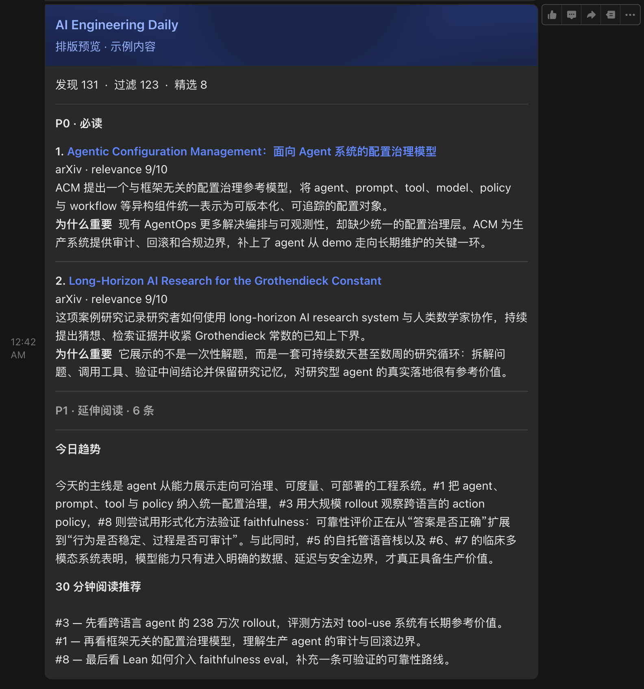
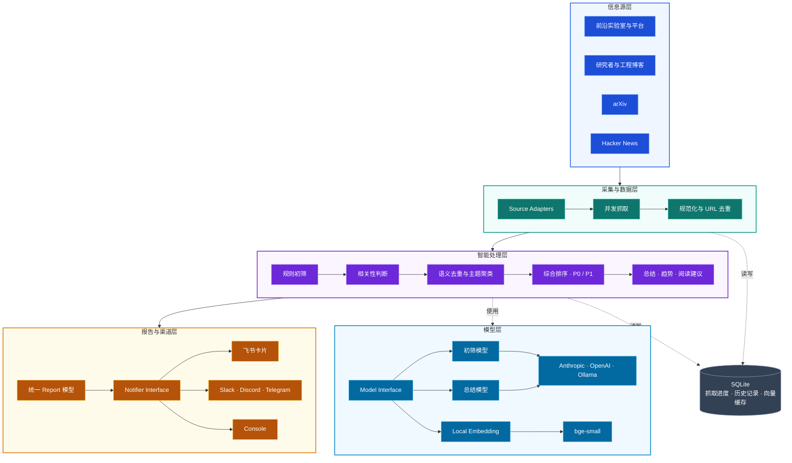

# Frontier Signal

Frontier Signal 是为 AI 工程师打造的前沿追踪工具，自动关注领域内的最新进展。它持续扫描前沿实验室、
工程博客、arXiv 和 Hacker News，帮助你快速发现真正值得关注的内容。

系统使用 AI 模型辅助完成内容筛选，自动去除重复内容并生成简洁摘要，最终整理成按重要程度排序的每日
和每周精选，推送到飞书、Slack、Discord、Telegram 或终端。

它重点关注 Agent 系统、模型服务、评测、上下文工程、Memory、MCP、工具调用、AI Coding、
RAG、RSI（Recursive Self-Improvement）、分布式训练与推理，以及生产级 AI 基础设施。

[English](./README.md) · [系统设计](./docs/design.md) ·
[参与贡献](./CONTRIBUTING.md)


---

## 关注什么

Frontier Signal 只关注 **AI 工程**，不收录融资消息和泛科技新闻。

| 类型 | 默认信息源 |
|---|---|
| 前沿实验室与平台 | Anthropic、OpenAI、Google DeepMind、Google AI、Google Research、Meta AI、Microsoft Research、Hugging Face、BAIR、PyTorch、Answer.AI |
| 研究者与工程博客 | Lilian Weng、Sebastian Raschka、Chip Huyen、Jay Alammar、Eugene Yan、Simon Willison、Phil Schmid、Interconnects、Latent Space、The Gradient |
| 论文与技术社区 | arXiv、Hacker News |

它不会按发布时间简单罗列内容，而是完成筛选、去重和总结，再组织成可以直接阅读的日报：

| 输入 | 输出 |
|---|---|
| 所有新文章 | 只保留与关注方向相关的内容 |
| 同一事件的重复报道 | URL 与语义双重去重 |
| 标题和原文摘要 | 精炼总结，以及「为什么重要」 |
| 按发布时间排列的信息流 | P0 必读、P1 延伸阅读和每周趋势总结 |

---

## 你会收到什么

每天从约 130 条候选内容中筛出 5–8 条。每条包含核心结论和「为什么重要」，并按
P0 必读、P1 延伸阅读组织，最后给出今日趋势和 30 分钟阅读建议：



---

## 快速开始

环境要求：[uv](https://docs.astral.sh/uv/) 和 Python 3.11+。

### 1. 安装与预览

```bash
git clone https://github.com/leungll/FrontierSignal.git frontier-signal
cd frontier-signal
uv sync
uv run radar preview
```

`preview` 抓取最新内容并将结果打印到终端，不会发送消息。首次运行无需 API key 或
webhook；未配置模型时，项目会使用关键词完成筛选。每次预览都从全新状态开始，不会
影响之后的日报。

### 2. 配置模型与推送

```bash
uv run radar init
```

初始化向导分为四步：

- **Step 1：** 选择模型服务，并设置初筛模型和总结模型
- **Step 2：** 选择推送渠道，并填写对应的连接信息
- **Step 3：** 选择中文或英文报告
- **Step 4：** 设置日报和周报的发送时间

完成后，配置会保存到 `.env`。向导会自动读取本机时区并更新 GitHub Actions 的运行
时间。输入 API key 或 webhook 时，终端不会显示内容；保存成功后会给出明确提示。

### 3. 测试配置

```bash
uv run radar test-notify  # 向当前渠道发送连接测试
uv run radar test-layout  # 向当前渠道发送排版示例
```

`test-layout` 使用内置示例内容，不抓取信息源，也不调用模型。还可以指定渠道或语言：

```bash
uv run radar test-layout --channel lark
uv run radar test-layout --channel all
uv run radar test-layout --language en
```

`all` 会跳过尚未完成配置的渠道，并在终端列出原因。

### 4. 运行日报

```bash
uv run radar preview  # 检查筛选与总结结果，不发送消息
uv run radar run      # 生成并发送日报
```

`run` 会记住已经处理过的内容，避免重复推送。如果当天没有新的入选内容，项目不会发送
空日报，并会在终端说明原因。

---

## 工作原理



主流程按内容流向展开：从前沿实验室、研究者博客、arXiv 和 Hacker News 获取内容，
通过统一的 Source Adapter 并发抓取、规范化并完成 URL 去重，再进入智能处理层。

智能处理层依次完成规则初筛、LLM 相关性判断、语义去重、主题聚类和综合排序，最终生成
P0 / P1、逐条总结、今日趋势和阅读建议。

模型层通过统一接口提供初筛、总结和 embedding。处理流程不依赖具体厂商，因此初始化时
选择 Anthropic、OpenAI、Ollama 或其他兼容服务后，后续流程无需改变。

报告与渠道层先生成统一的 Report，再由 Notifier 分别渲染飞书卡片、Webhook 消息或
终端输出。SQLite 独立保存抓取进度、历史文章和向量缓存。CLI 与 GitHub Actions 只是
两种启动方式，共用图中的完整处理流程。

---

## 模型与推送渠道

运行 `radar init` 时，可以直接选择模型服务、初筛模型和总结模型。之后切换模型只需
修改 `.env`。

| 层级 | 支持选项 |
|---|---|
| 模型服务 | Anthropic、OpenAI、Ollama、其他 OpenAI 兼容服务，或仅使用关键词筛选 |
| 推送 | 飞书 / Lark、Slack、Discord、Telegram、console |
| 语言 | 中文（`zh`）或英文（`en`） |

所有设置见 [`.env.example`](./.env.example)。飞书会渲染可折叠卡片，其他推送渠道
使用 Markdown。

---

## 每日自动运行

用 GitHub Actions 定时发送日报和周报，无需自建服务器：

1. Fork 并克隆本仓库。
2. 运行 `uv run radar init` 完成配置。
3. 打开仓库的 **Settings → Secrets and variables → Actions**，**按 `radar init` 最后的输出逐项添加**：
   - 在 **Variables** 页点击 **New repository variable**，填写变量名和值。
   - 在 **Secrets** 页点击 **New repository secret**，填写 API Key、Webhook 等敏感信息。
   - 每项填写后点击 **Add variable** 或 **Add secret** 保存。
4. 提交并推送 [`.github/workflows/`](./.github/workflows/) 中的时间配置修改，然后在 **Actions → Frontier Signal Daily → Run workflow** 试跑一次。

例如，选择 Anthropic + Lark + 英文报告时，向导会输出：

```text
GitHub Actions repository variables
  LLM_PROVIDER=anthropic
  FILTER_MODEL=claude-haiku-4-5-20251001
  SUMMARY_MODEL=claude-opus-4-8
  NOTIFIER=lark
  LANGUAGE=en

GitHub Actions repository secrets
  ANTHROPIC_API_KEY
  LARK_WEBHOOK_URL
  LARK_WEBHOOK_SECRET (optional)
```

Variables 需要同时填写名称和值；Secrets 使用上面显示的名称，值填写你在 `radar init`
中输入的密钥或 Webhook。

**Variables（前五项必填）**

| Name | Value 示例 |
|---|---|
| `LLM_PROVIDER` | `anthropic` 或 `openai` |
| `FILTER_MODEL` | `claude-haiku-4-5-20251001` 或 `gpt-4o-mini` |
| `SUMMARY_MODEL` | `claude-opus-4-8` 或 `gpt-4o` |
| `NOTIFIER` | `lark`、`slack`、`discord`、`telegram` 或 `console` |
| `LANGUAGE` | 中文填 `zh`，英文填 `en` |
| `OPENAI_BASE_URL` | 仅 OpenAI-compatible 服务需要；官方 OpenAI 无需添加 |

**Secrets（按你的选择添加）**

| 使用场景 | Name | Value |
|---|---|---|
| Claude | `ANTHROPIC_API_KEY` | Anthropic API Key |
| OpenAI / compatible | `OPENAI_API_KEY` | 服务商提供的 API Key |
| 飞书 / Lark | `LARK_WEBHOOK_URL` | 自定义机器人 Webhook 地址 |
| 飞书签名校验（可选） | `LARK_WEBHOOK_SECRET` | 自定义机器人的签名密钥 |
| Slack | `SLACK_WEBHOOK_URL` | Incoming Webhook 地址 |
| Discord | `DISCORD_WEBHOOK_URL` | Webhook 地址 |
| Telegram | `TELEGRAM_BOT_TOKEN` | @BotFather 提供的 Token |
| Telegram | `TELEGRAM_CHAT_ID` | 接收消息的 Chat ID |

例如选择 OpenAI + 飞书，只需添加 `OPENAI_API_KEY`、`LARK_WEBHOOK_URL`（启用签名校验时再添加
`LARK_WEBHOOK_SECRET`），以及 Variables 表中的前五项。名称必须完全一致，值不要加引号。

成功后，日报会每天自动发送，周报会汇总最近 7 天的内容。需要修改任一发送时间时，运行
`uv run radar schedule`，再推送它生成的 workflow 修改即可。

使用 Ollama 时，GitHub Actions 无法访问本机 `localhost`，请提供可公网访问的地址或使用 self-hosted runner。

---

## 开发与扩展

安装开发依赖并运行质量检查：

```bash
uv sync --extra dev
uv run pytest
uv run ruff check .
uv run ruff format --check .
```

测试使用本地 fixture 和 HTTP mock，不需要网络、模型 API key 或 webhook。修改筛选、
去重、排序和排版后，应先运行完整测试，再使用以下命令检查真实输出：

| 用途 | 命令 |
|---|---|
| 运行一次独立预览 | `uv run radar preview` |
| 检查 Markdown 输出 | `uv run radar test-layout --channel console` |
| 检查飞书卡片 | `uv run radar test-layout --channel lark` |
| 查看各信息源的抓取状态 | `uv run radar sources` |

项目通过小型接口隔离信息源、模型和推送渠道，新增能力不需要修改整条处理流程：

| 扩展内容 | 修改位置 |
|---|---|
| 新增 RSS / Atom 信息源 | 在 [`config/sources.yaml`](./config/sources.yaml) 添加配置 |
| 新增 API 信息源 | 在 [`radar/sources/`](./radar/sources/) 实现抓取逻辑 |
| 新增模型服务 | 实现 [`LLMClient`](./radar/llm/base.py)，并接入 [`factory.py`](./radar/llm/factory.py) |
| 新增推送渠道 | 实现 [`Notifier`](./radar/notify/base.py)，并接入 [`factory.py`](./radar/notify/factory.py) |
| 新增报告语言 | 在 [`radar/i18n.py`](./radar/i18n.py) 添加标签和模型写作要求 |
| 修改筛选与排序 | 调整 [`config/interests.yaml`](./config/interests.yaml) 或 [`radar/pipeline/`](./radar/pipeline/) |

提交代码前请确保测试与 Ruff 检查通过。贡献规范见
[CONTRIBUTING.md](./CONTRIBUTING.md)。

## 配置参考

运行 `radar init` 可以完成常规设置；需要精细调整时，再直接修改以下文件或环境变量：

| 修改内容 | 文件 |
|---|---|
| 信息源、名称和来源权重 | [`config/sources.yaml`](./config/sources.yaml) |
| 关注主题、关键词权重、排除规则、日报条数和单一来源配额 | [`config/interests.yaml`](./config/interests.yaml) |
| 模型服务、模型名称、推送渠道、报告语言和连接信息 | [`.env.example`](./.env.example) |
| 相关性判断标准 | [`radar/pipeline/llm_filter.py`](./radar/pipeline/llm_filter.py) |
| 中英文固定文案与写作要求 | [`radar/i18n.py`](./radar/i18n.py) |

`.env` 保存当前机器的运行配置和敏感信息，不应提交到 Git。YAML 文件适合保存可以进入
版本控制的内容策略，例如信息源、主题权重和来源配额。环境变量会覆盖 `.env` 中的同名
设置，GitHub Actions 正是通过这种方式加载 Variables 和 Secrets。

## 项目边界

Frontier Signal 聚焦 AI 工程研究与生产实践。它的核心任务是从公开信息源中筛选、
去重、排序和总结值得工程师投入时间的内容。

项目当前不提供全文收藏、稍后阅读、团队知识库、用户反馈训练或托管 SaaS。它也不追求
覆盖所有 AI 新闻；融资、政策、泛科技新闻和营销内容默认排除。新增来源和功能应提高
信号质量，或让模型与渠道更容易替换，而不是单纯扩大收录数量。

GitHub release 与主流 AI framework release 的结构化跟踪仍在计划中。

## 许可证

[MIT](./LICENSE) © Lili Liang
